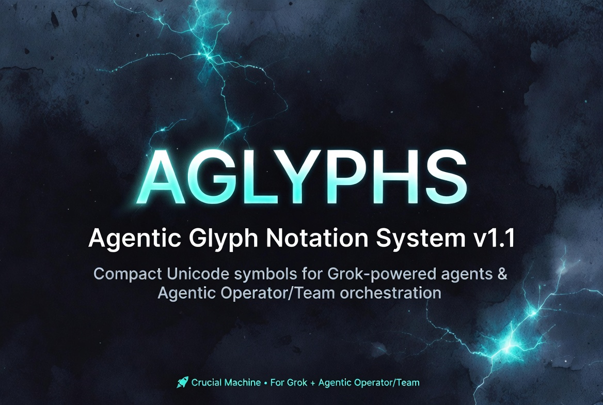

# Aglyphs ⚡




**Compact symbolic notation for Grok-powered agentic systems**

Aglyphs lets you describe complex AI agent architectures, teams, memory systems, and workflows in **one compact line** — perfect for docs, code comments, whiteboards, and GitHub READMEs.

```md
⨁(𝔾) ⇑ {𝔸_research[𝕄ᵛ], 𝔸_code[𝕋]} → ▷
```

*Made for builders who hate bloated diagrams.*

---

## Quick Examples

- **Single Grok ReAct Agent**: `𝔾[Λˣ ⊗ 𝕋] (⊙ → Λ → ⊚ → ▷) ⟳`
- **Grok as Operator**: `⨁(𝔾) [Λˣ + 𝕄ˡ + 𝕋] ⇑ {team}`
- **Parallel Team**: `⨁(𝔾) (𝔸₁ ⊕ 𝔸₂) → ▷`
- **With Human Oversight**: `𝔾 → ⨁ → ⊕ → ▷`

See [`AGLYPHS-NOTATION.md`](AGLYPHS-NOTATION.md) for the full specification and pattern library.

## Why Aglyphs?

- **Ultra-compact** — describe entire teams in < 60 chars
- **Text-native** — works everywhere (no images needed)
- **AI-native** — symbols for reflection, memory types, orchestration
- **Extensible** — easy to add your own glyphs
- **Git-friendly** — pure text, diffs beautifully

## Installation / Usage

Just copy the glyphs into your Markdown. For better rendering, use a font that supports mathematical symbols (most modern ones do).

**Recommended fonts:**
- JetBrains Mono
- Fira Code
- DejaVu Sans Mono
- Any Unicode-friendly editor font

For a live playground, see the [web demo](https://github.com/rb-thompson/aglyphs) (coming soon).

---

## Project Status

- **Version**: 0.2.0 (2026-03-25)
- **License**: MIT
- **Status**: Early but stable — open to community patterns and renderer contributions

---

## Specification & Reference

- [`AGLYPHS-NOTATION.md`](AGLYPHS-NOTATION.md) — Complete glyph reference, syntax, and ready-to-use patterns
- [`COMPARISON.md`](COMPARISON.md) — Comparison with Mermaid, LangGraph, CrewAI, and formal notations

## Contributing

Pull requests welcome! Especially:
- New useful patterns
- Additional glyphs for new paradigms (MoE, critic loops, etc.)
- Font recommendations or CSS for better rendering
- A JavaScript renderer / Mermaid plugin

---

---

## Contributing

We welcome contributions from both **developers** and **autonomous agents**.

**High-value contributions:**

- New patterns for emerging paradigms (Mixture-of-Experts, multi-agent debate, critic loops, etc.)
- Additional glyphs with strong justification
- Font embedding / CSS for better rendering
- JavaScript/Mermaid renderer or VS Code extension
- Real-world usage examples from production agent systems

See [`CONTRIBUTING.md`](CONTRIBUTING.md) (coming soon) for guidelines.

---

**Made for the agentic future.**

— Brandon Thompson & Blink (2026)

